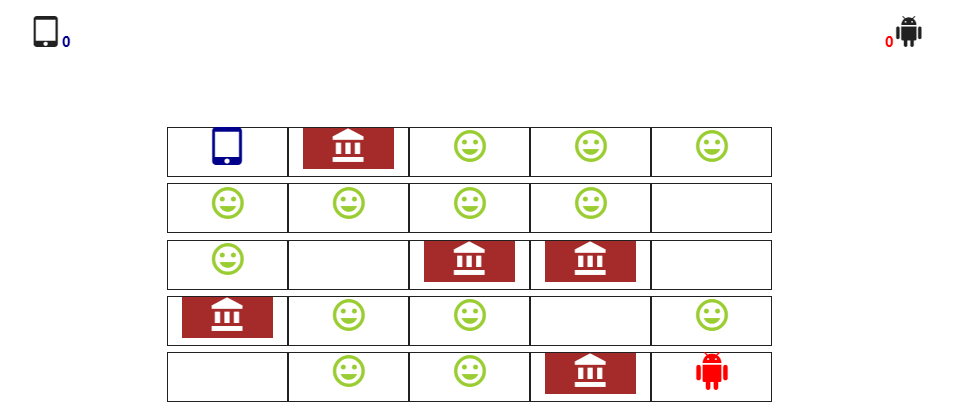

# Gold Rush
A two-user game based on a matrix data structure, players move through keyboard keys: arrows and waxd keys. Players are given a choice to select a number of columns and rows will be for the game board.
The board is then filled with coins and walls randomly.
Players should "eat" as many coins as possible on the board, walls cannot be crossed.

## Table Of Contents
- [Gold Rush](#Gold-Rush)
  * [Running the project](#running-the-project)
  * [Screenshots](#Screenshots)
    + [Start](#start)
    + [Game](#game)
   
  * [Tech-Stack](#Techstack)
  * [TODO](#todo)

## Running the project

1. Clone the repo
2. open  index.html file in a browser.

## Screenshots

### Start
Select how many rows and columns will be in the game board

### Game
The board  filled with coins and walls randomly.
Players should "eat" as many coins as possible on the board, walls cannot be crossed.
players move through keyboard keys: arrows and waxd keys.

## Techstack
1. Jquery Material-UI handelbars,matrix data structure.

## TODO
1. Allow for mutiple clients to play against each other (not only on the same computer) using Socket IO.
2. Fix algorithm which places walls to not trap players or coins.
3. Reset the board after a player wins.

